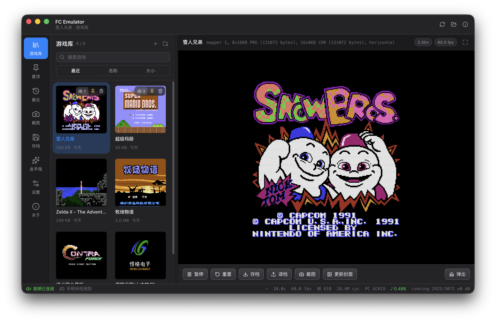

# FC Emulator

macOS 上的 NES / FC 模拟器。**打开就能玩**：把 `.nes` 拖进窗口，接上手柄或者用键盘，开始。



**[⬇️ 下载最新版本](https://github.com/lazyfury/FCEmulator/releases/latest)** · [源码](https://github.com/lazyfury/FCEmulator) · 它同时也是一份「从二进制到屏幕上的像素」的计算机科学学习工程。

---

## 下载与安装

1. 打开 [Releases](https://github.com/lazyfury/FCEmulator/releases/latest)，下载 `FC Emulator-<版本>-arm64.dmg`（Apple Silicon）。
2. 双击打开 dmg，把 **FC Emulator** 拖进「应用程序」。
3. 第一次打开若提示**「已损坏，无法打开」**，那是 macOS 对未签名应用的隔离标记，执行一次即可：

   ```bash
   xattr -dr com.apple.quarantine "/Applications/FC Emulator.app"
   ```

> 仓库里**不包含任何 ROM**（版权且体积大）。请使用你合法拥有的游戏文件。

## 能做什么

| 功能 | 说明 |
|---|---|
| 🎮 **游戏库** | 把 `.nes` 或一整个文件夹拖进窗口即导入。置顶、搜索、排序、游玩次数、封面与截图都记住（SQLite 存库，文件夹仍然是唯一事实） |
| 🕹 **双人 + 手柄** | 两个手柄端口、单人/双人键盘模式；每个按键都能重绑定；原生 GameController 助手支持多只手柄，每只手柄可指定 1P / 2P / 关闭 |
| 💾 **存档与倒带** | 4 个存档槽 + 快速存/读，按住 Backspace 倒带 10 秒。存读往返在原生与 WebAssembly 两边逐像素校验 |
| ✨ **金手指** | 按地址写入/锁定一个字节，实时显示当前值 —— 例如马里奥的命数就在 `$075A`，按游戏分别保存 |
| 🖼 **画面** | 整数倍像素缩放（游戏像素永远是整数个物理像素）、扫描线滤镜、F11 全屏 |
| 🔊 **声音** | 完整的五声道 APU，经 Web Audio 低延迟输出，掉帧与欠载都会被计数 |
| 📼 **兼容性** | 35 个 mapper（NROM、MMC1、UxROM、CNROM、MMC3、MMC2/4、VRC2/4、Namco 163、Sunsoft-4、多合一……），429 个单元测试 |

### 默认按键

| 按键 | | 按键 | |
|---|---|---|---|
| 方向键 / WASD | 方向 | `ESC` / `P` | 暂停 |
| `Z` / `J` | B | `R` | 重置 |
| `X` / `K` | A | `F1`–`F3` / `⇧F1`–`⇧F3` | 存/读第 1–3 槽 |
| `Enter` / `Space` | Start | `F5` / `F6` | 快速存 / 快速读 |
| `Tab` / 右 `Shift` | Select | `Backspace`（按住） | 倒带 |

全部可在「设置 → 按键绑定」里改。详见 [electron/README.md](electron/README.md)。

---

## 从源码运行

```bash
brew install cmake ninja googletest

./wasm/build.sh                 # 把 C++ Core 编译成 WebAssembly
cd electron && pnpm install
pnpm run dev                    # 开发窗口；pnpm start 跑生产构建
```

---

## 当前状态

**Phase 7 完成** — Electron 前端

- [x] CMake 4.4 + C++20 + Ninja
- [x] GoogleTest 1.18 单元测试（429 个测试全通过）
- [x] `src/core/types.hpp` `bit.{hpp,cpp}` `alu.hpp`
- [x] `src/core/bus.hpp` 总线抽象（含 `take_stall_cycles()`）
- [x] `src/core/cpu/` 全部 151 个 opcode、256 项周期表、反汇编器、寻址
- [x] `src/core/nes/` 地址译码、2KB RAM 镜像、open bus、OAM DMA
- [x] `src/core/nes/ines.{hpp,cpp}` **iNES 文件头解析**
- [x] **Mapper 0 / 1 / 2 / 3 / 4 / 7 / 9 / 10 / 11 / 13 / 15 / 18 / 19 / 21 / 22 / 23 / 25 / 32 / 33 / 66 / 68 / 71 / 78 / 87 / 162 / 163 / 164 / 177 / 178 / 190 / 226 / 227 / 242 / 246 / 249**
      （NROM、MMC1、UxROM、CNROM、MMC3 含扫描线 IRQ、AxROM、
      MMC2、MMC4、Color Dreams、CPROM、100-in-1、SS88006、Namco 163、
      VRC2/VRC4、IREM、Taito、GxROM、Sunsoft-4、Codemasters、Jaleco、
      Waixing、Nanjing、Henggedianzi、Magic Kid Goo Goo、多合一、T9552）
      `src/core/nes/mapper0.hpp` … `mapper15.hpp`
- [x] `src/core/nes/cartridge.{hpp,cpp}` 真正的卡带：加载 .nes 文件
- [x] `src/core/nes/ppu.{hpp,cpp}` **PPU：渲染管线、精灵、滚动、sprite 0 hit**
- [x] `src/core/nes/machine.{hpp,cpp}` **CPU/PPU 3:1 同步、NMI 传递**
- [x] `src/core/nes/framebuffer.hpp` 256×240 输出
- [x] `src/core/nes/controller.hpp` 手柄串行协议，两个端口接在 `$4016`/`$4017`
- [x] `src/core/nes/apu.{hpp,cpp}` **五个声道、包络、长度/线性计数器、扫频、帧序列器、非线性混音、DMC**
- [x] 11 个教学 demo；15 个测试文件
- [x] `docs/` 十七章
- [x] `src/ffi/emulator_api.h` **纯 C 接口**
- [x] `electron/` **Electron + TypeScript 前端**（WebAssembly 里跑 Core，canvas 出画面，Web Audio 出声），含可验证的无头模式

**现在能运行真实的 NES ROM 并画出画面了：**

```bash
./build/demo_ppu "" 240
sips -s format png frames/frame_240.ppm --out frame.png
```

```
第 8-22 行   状态栏文字（MARIO / WORLD 1-1 / TIME）
第 40-150 行 SUPER MARIO BROS. 大标题
第 192-206 行 马里奥本人（精灵渲染正确）
第 208-238 行 地面砖块
```

**现在可以模拟按键并让游戏真的玩起来：**

```bash
./build/demo_input
```

```
无输入 120 帧:     218 个像素变化  (0.35%)   标题画面静止
按下 Start 5 帧: 57207 个像素变化  (93.11%)  游戏开始了
按住 Right 180 帧: 14763 个像素变化          关卡滚动了
```

**现在有声音了：**

```bash
./build/demo_apu
afplay frames/game_audio.wav
```

```
  samples        : 440277  (9.98 seconds)
  peak           : 0.68
  channels on    : $0f   (pulse 1, pulse 2, triangle, noise)
  frames audible : 459 of 600
```

**而且可以在窗口里玩了：**

```bash
./wasm/build.sh                 # 把 Core 编译成 WebAssembly
cd electron && pnpm install
pnpm run dev                    # 开发窗口；或者 pnpm start 跑生产构建
```

```
CPU  / Bus / Cartridge / PPU / APU / Controller   <- Core (C++)
                     |
              src/ffi/emulator_api.h              <- 纯 C 边界
                     |
              wasm/ (Emscripten)                  <- 同一份 Core 编译成 WebAssembly
                     |
   Electron (TypeScript, canvas + Web Audio)      <- 前端
```

游戏从内置游戏库选，或者直接把 `.nes` 拖进窗口。详见 [electron/README.md](electron/README.md)。

**项目完成。** 从二进制到屏幕上的像素，全链路打通。

完整路线图见 [AGENTS.md](AGENTS.md)。

---

## 完整构建与测试（开发者）

依赖：

```bash
brew install cmake ninja googletest
```

构建与测试：

```bash
cmake -S . -B build -G Ninja -DCMAKE_BUILD_TYPE=Debug
cmake --build build
ctest --test-dir build --output-on-failure
```

运行教学 demo：

```bash
./build/demo_bitwise      # 位、字节、数制、补码
./build/demo_overflow     # C 与 V 标志、有符号比较
./build/demo_cpu          # 取指 / 译码 / 执行循环
./build/demo_disasm       # 汇编 <-> 机器码
./build/demo_addressing   # 有效地址、zero page 回绕、JMP 硬件 bug
./build/demo_instructions # 完整指令集、ADC、中断、周期
./build/demo_bus          # 地址译码、镜像、open bus、OAM DMA
./build/demo_cartridge    # iNES 文件头、Mapper 0-15、运行真实 ROM
./build/demo_ppu          # 渲染真实游戏的画面 -> PPM
./build/demo_input        # 模拟按键，标题画面 -> 开始游戏
./build/demo_apu          # 五个声道的波形 -> game_audio.wav

# 前端
./wasm/build.sh
cd electron && pnpm install && pnpm start
```

用真实 ROM 跑测试（默认会查找 `tests/data/*.nes`）：

```bash
ln -s /path/to/game.nes tests/data/game.nes   # 或者：
FC_TEST_ROM=/path/to/game.nes ctest --test-dir build
```

---

## 发布（本地打包并上传）

不用 GitHub Actions：在本地把 Core 编成 WebAssembly、打包成 dmg/zip，再交给 `gh` 传到 GitHub Releases。需要 [GitHub CLI](https://cli.github.com/) 且已 `gh auth login`。

```bash
./scripts/release.sh --dry-run     # 预演：构建、打包、生成 SHA256，不发 Git 也不传 GitHub
./scripts/release.sh 0.2.0         # 改版本号 -> 构建 -> 打标签 -> 推送 -> 上传
./scripts/release.sh               # 沿用 electron/package.json 里的版本号
./scripts/release.sh --draft       # 先建 draft release，确认后再手动 publish
```

脚本会依次做这些事，任一步失败就停下：

1. 检查工作区干净、当前在 `main`、`gh` 已登录，且 `v<版本>` 标签不存在；
2. `wasm/build.sh` 重编 Core，`pnpm run build` 编主进程 / 渲染进程 / 手柄助手；
3. `electron-builder` 在 `electron/release/` 里产出 `.dmg`、`.zip` 和 `SHA256SUMS.txt`；
4. 改 `electron/package.json` 的版本号并提交，打并推送 `v<版本>` 标签；
5. `gh release create` 建 release，release notes 自动汇总自上一个标签以来的提交，并把产物全部上传。

发布出来的 dmg 未签名，用户首次打开需要跑一次 `xattr`（见开头「下载与安装」）。

---

## 目录结构

```
FCEmulator/
├── AGENTS.md            AI Agent 执行规范（本项目宪法）
├── CMakeLists.txt
├── docs/                学习文档
│   ├── images/            README 用的截图
│   ├── computer-science/  二进制 / 十六进制 / 补码 / 位运算 / V flag / CPU / 汇编
│   ├── architecture/      系统架构
│   ├── assembly/          6502 汇编索引
│   └── nes/               NES 硬件规范
├── src/
│   ├── core/            纯 C++ 核心，禁止依赖 UI
│   │   ├── types.hpp      定宽整数
│   │   ├── bit.{hpp,cpp}  位运算工具
│   │   ├── alu.hpp        加法器与标志位
│   │   ├── bus.hpp        总线抽象
│   │   ├── flat_bus.hpp   测试替身：64KB 平铺内存
│   │   ├── cpu/           寄存器、opcode 表、反汇编、寻址、表驱动派发
│   │   └── nes/           地址译码、卡带、PPU、APU、手柄、Machine
│   └── ffi/            纯 C 接口（前端唯一需要链接的东西）
├── wasm/               同一份 Core 编译成 WebAssembly 的脚本与绑定
├── electron/           Electron + TypeScript 前端
│   ├── src/            主进程 / preload / 渲染进程
│   ├── native/         手柄助手：macOS 用 Swift + GameController（gamepad/），
│   │                   Windows 用 C++ + XInput（gamepad-cpp/），协议一致
│   └── test/           前端的 Node 测试
├── tools/               教学 demo 与命令行工具
├── scripts/             本地发布脚本（release.sh）
└── tests/               单元测试
```

---

## 学习入口

**先读 [docs/computer-science/README.md](docs/computer-science/README.md)。**

它解释了为什么本项目不直接从写 CPU 开始。

---

## 设计原则

1. **核心与 UI 分离** — `src/core` 是纯 C++，不知道窗口、Canvas 或 Electron 存在
2. **禁止 CPU 直接访问 PPU** — 一切经过 Bus
3. **一切核心模块必须有测试**
4. **每个阶段先理解，再实现**

---

## 路线图

```
Phase 0   工程基础            [done]
Phase 0.1 二进制基础          [done]
Phase 0.2 CPU 基础            [done]
Phase 0.3 6502 汇编           [done]
Phase 0.4 寻址模式            [done]
Phase 1   完整 6502 + 周期精确  [done]
Phase 2   NES Bus 内存映射      [done]
Phase 3   Cartridge / Mapper   [done]
Phase 4   PPU                  [done]
Phase 5   Controller           [done]
Phase 6   APU                  [done]
Phase 7   Electron 前端         [done] <-- WebAssembly + Canvas + Web Audio
```
